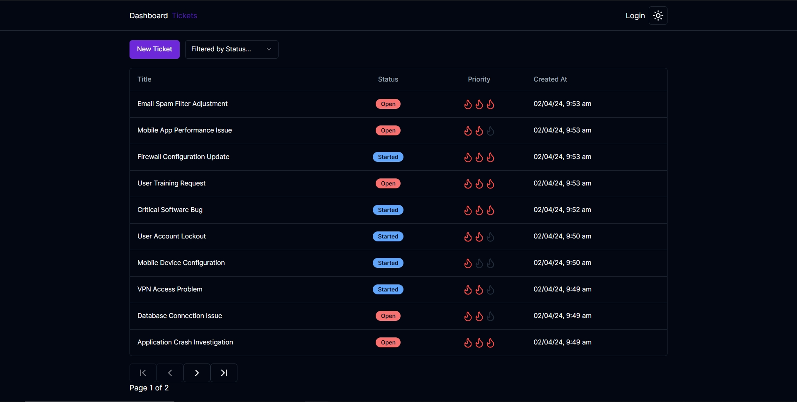

# Tech Ticket Application

## Project Description

This project is deployed on the website: [https://ticket-application-psi.vercel.app/](https://ticket-application-psi.vercel.app/)

This Tech Ticketing Application, built with Next.js 14, Tailwind CSS, NextAuth, and Prisma, using Postgres as database and deployed on Vercel, is a full-stack project that demonstrates a modern approach to web application development.

### UI Overview

Here's a glimpse of the Application.

<p align="center">
  
  <br>
  <em>Figure 1: Ticket Overview</em>
</p>
<p align="center">
  
  <br>
  <em>Figure 2: Dashboard View</em>
</p>

## Technical Stack

This application utilizes several modern web technologies, including:

- **Next.js 14**: Used for server-side rendering, static site generation, and building the overall application structure.

- **Tailwind CSS**: A utility-first CSS framework for creating custom designs without writing CSS from scratch.

- **Prisma: ORM**: Efficient database management with MySQL, enabling CRUD operations and data modeling.

- **Next Auth**: A complete solution for adding authentication and authorization to this applications.

- **Shadcn UI**: A component library used to enhance the application's aesthetics with customizable UI elements.

## Installation and Running

Firstly, install dependency and set up database:

```bash
npm install
npx prisma init --datasource-provider postgres
npx prisma migrate dev
```

Then, run the project:

```bash
npm run dev
```

Open [http://localhost:3000](http://localhost:3000) with your browser to see the result.

You can start editing the page by modifying `app/page.tsx`. The page auto-updates as you edit the file.

This project uses [`next/font`](https://nextjs.org/docs/basic-features/font-optimization) to automatically optimize and load Inter, a custom Google Font.

## How to Contribute

Contributions to this project are always welcome. Here's how you can help enhance its features or make improvements:

### Fork the Repository

Start by forking the project repository, then clone your fork using:

```bash
git clone https://github.com/ZaneCodeJourney/Ticket-Application.git
```

### Create a New Branch

It's recommended to create a new branch for each feature or fix:

```bash
git checkout -b name-of-your-new-branch
```

### Make Your Changes

Implement your desired modifications or additions to the code.

### Commit Your Changes

Once done, save your changes:

```bash
git commit -m "Provide a brief description of your changes here"
```

### Push to Your Branch

Push your updates to your branch:

```bash
git push origin name-of-your-new-branch
```

### Open a Pull Request

Navigate to the original project repository on GitHub and submit a pull request. Ensure you give a detailed explanation of the changes you've made.

Your contribution will be reviewed, and if it meets the project's standards and objectives, it'll be merged. Thanks in advance for your effort and input!

## Contact Me

If you have questions or wish to discuss the project further, don't hesitate to reach out:

- **Email:** [wenziyang007@gmail.com](mailto:wenziyang007@gmail.com)

I'm always open to feedback, collaboration, or general inquiries. Looking forward to hearing from you!
